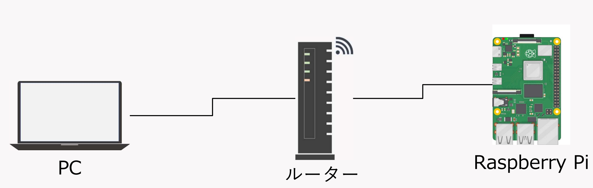

### Linux

今日では様々なOS(Operating System)が利用されており，身近なものとしてはWindows OSやmacOS (Mac OS X)があげられるかと思いますが，それ以外にもUnixやLinuxといったOSが存在しており，この実験ではLinuxの一種であるRaspberry Pi OSを使用します．

LinuxはWindows OSやmacOSと同様にコンピュータを動かすためのソフトウェアであるという点では同じですが，次のような点で差異が見て取れます．
- オープンソース：

    無償でソースコードが公開されており，自由に改変することができる
- サーバ用途で用いられることが多い：

    Webサーバ等を構築するための高品質なソフトウェアが充実している
- GUI (Graphical User Interface)とCLI（Command Line Interface）を併用：
    
    マウス，キーボードでの操作だけでなく，ターミナルエミュレータ（端末）を介してコマンドを入力することでコンピュータを操作することも


### Rsapberry Pi OSをインストール

【課題1】

この実験ではRaspberry Pi OSを使って，OSを自力でインストールし，電子工作を行うための環境構築を行ってもらいます．
以下に大まかな手順を示していますので，各グループで調べつつOSのインストールと環境のセットアップをしてみましょう．

1. ラズパイOSのダウンロード: 
    
    公式サイトから最新版のRaspberry Pi OSをダウンロードします。

2. SDカードのフォーマット: 
    
    SDカードをPCに接続し，SDカードフォーマッターなどのツールを使ってフォーマットします．

3. ラズパイOSの書き込み: 
    
    ダウンロードしたRaspberry Pi OSのイメージをSDカードに書き込みます．
    - Raspberry Piの型番：Raspberry Pi 4
    - OS：64-bit
    - Strage：SDカードを指定

4. SDカードの取り出しとラズパイへの挿入: 

    書き込みが完了したらSDカードをPCから取り出し，ラズベリーパイに挿入します．

5. ラズパイの起動: 

    ラズパイに電源を接続し，起動します．

6. 初期設定: 

    起動後，画面に従ってユーザ名やパスワード，言語，キーボードレイアウトなどの初期設定を行います．
    
    - 注1）ユーザ名は`pi`，パスワード`okadai`としてください
    - 注2）WiFiの設定とアップデートのチェックはスキップして構いません

7. システムアップデート: 

    初期設定が完了したら，GUIでWiFi（00ouwifi）へ接続します．接続の際には以下のように設定します．
    - Security：WPA/WPA2 Enterprise
    - 認証：保護つきEAP(PEAP)
    - ユーザ名：岡大ID
    - パスワード：岡大IDのパスワード
    
    ターミナルから以下のコマンドを実行してシステムを最新のものへアップデートします．
    ```
    sudo apt update
    sudo apt full-upgrade -y
    ```
8. 再起動: 

    アップデートが完了したら，以下のコマンドで再起動します．
    ```
    sudo reboot
    ```


### Raspberry Piを遠隔操作

OSをインストールすることができたら，Raspberry PiをWi-Fi経由で別のコンピュータから制御してみましょう．
手順は大きく分けると以下の通りです．
1. Raspberry Piへsshサーバをインストール
2. Raspberry PiのIPアドレスを調べる
3. 別のコンピュータからssh接続を行う

手順は少ないように見えますが，sshやIPアドレスについて知るために，まずは無線通信の中身について少し触れてみましょう．

普段からWi-FiやBluetooth，5Gといった言葉は聞きなじみがあるかと思いますが，これらの無線通信方式は通信可能な距離で分類され，実は身近なところではよりたくさんの通信方式が利用されています．

1. 近距離無線：
    
    通信距離としては10m程度までで，NFC（Apple payなど）が代表的な方式

2. 無線PAN（Personal area network）：

    通信距離は10～20m程度で，Bluetoothが代表的な方式

3. 無線LAN（Local area network）：

    約100mまで通信可能で，Wi-Fiが代表的な方式

4. 無線WAN（Wide area network）：

    いわゆる携帯電話回線網（5Gなど）で，基地局を介してグローバルに通信を行うことが可能

これらに加えて，プロトコルと呼ばれる通信する際の手順や規格を定めることで高速な通信や安定した通信を実現しています．
ここでは代表的なプロトコルとしてTCP（Transmission Control Protocol）とUDP（User Datagram Protocol）の特徴について概説します．

- TCP

    信頼性の高い通信を行うための仕組みで，Webページやメールなど受け取るべき情報が欠落することのないようにデータのやり取りを行います．

- UDP

    高速性やリアルタイム性を重視した仕組みで，動画のストリーミングなどで利用されます．TCPとは対照的に多少の情報欠落を許容します．

ここまでに出てきた無線接続方式やプロトコルを組み合わせることで様々なサービスが開発・利用されています．
ここではWi-Fiに接続されたRaspberry Piを遠隔から操作するための仕組みとしてssh（Secure shell）と呼ばれるプロトコルを利用します．

それでは，Raspberry Pi上で端末を起動し，以下のコマンドを実行してみましょう．

```
sudo apt update && sudo apt install ssh -y 
```
先ほども`sudo`や`apt`というものを使用しましたが，これらはそれぞれ次の用途で使用されています．
パスワードをきかれるので，メモしたパスワードを入力してください．

- `sudo`：

    Linux上で管理者と同等の権限でコマンドを実行することになります．言い換えるとシステムを自在に改変することができ，時にはシステムそのものを破壊しつくすことも可能なため，慎重かつ適切に利用する必要があります．

- `apt`：

    Raspberry Pi OSへソフトウェアをインストール，更新，削除する際のパッケージ管理をしてくれるコマンドです．今回はsshというパッケージをインストールするために使用しました．

これでRaspberry Pi側でssh接続を受け付ける準備ができました．

次に，Raspberry Pi上の端末でIPアドレスを調べます．
ここでは簡単に下図のような構成でPCとRaspberry Piが同じルータへWi-Fi接続しているとします．

<div align="center">
    
</div>

この構成ではPCとRaspberry Piはルータを介して情報のやり取りをしますが，通信を行うためにはそれぞれの送り先住所（=IPアドレス）を把握する必要があります（自宅から郵便局経由で岡山大学へ書類を送るのに似ていますね）．
このIPアドレスを調べるコマンドが`ip`です．

【課題2】

`ip`コマンドの使い方を検索し，Raspberry PiのIPアドレスを調べてみましょう．（以降では，`xxx.xxx.xxx.xxx`を調べたIPアドレスの代わりとして記載しています．各自で調べたものへ読み替えてください．）

それではRaspberry Piへssh接続してみましょう．
自身のコンピュータがWindowsの場合はコマンドプロンプトを，Macの場合にはターミナルを実行し，以下のコマンドを入力しましょう．

注）sshがインストールされていない可能性もあります．その場合には教員・TAへ教えてください．

```
ssh pi@xxx.xxx.xxx.xxx
```

自身で設定したパスワードを入力すればログインでき，自身のコンピュータ上で開いた端末からIPアドレスを調べるとRaspberry PiのIPアドレスが確かに表示されていることが確認できるはずです．

このように，CLIでRaspberry Piへ遠隔接続し，様々なコマンドを覚えることで，手元にコンピュータがなくとも制御が可能なことが体験できたのではないでしょうか．


### プログラミングを行うための環境構築

続いて，プログラミングを行うための環境構築をしてみましょう．
第1回，第2回ではGoogle Colaboratoryなどを用いてPythonでのプログラミングを体験しましたが，ここではPythonとGPIO(General-purpose input/ouput)を利用できるようにするための環境を自身で構築してみましょう．

ここでは環境構築のために2種類のパッケージ管理ツールを使用します．1つ目は先ほどもできた`apt`コマンドです．もう一つはPythonのパッケージ管理システム`pip`です．

【課題3】

まずは`apt`コマンドで`pip`とPythonの様々なパッケージをインストールする際に必要となる`python3-dev`をインストールしてみましょう．
それぞれ`apt`で指定するパッケージ名は`python3-pip`と`python3-dev`です．

【課題4】

次に，`pip`コマンドの使用方法を検索し，PythonからGPIOを制御するために必要なパッケージ`RPi.GPIO`をインストールしてみましょう．


【課題5】

最後に以下のソースコードを`test.py`という名前でRaspberry Pi上に作成し，実行してみましょう．
端末上で`python test.py`と入力して実行すれば`Hello World`と表示されるはずです．

```
import RPi.GPIO as GPIO

print('Hello World')
```